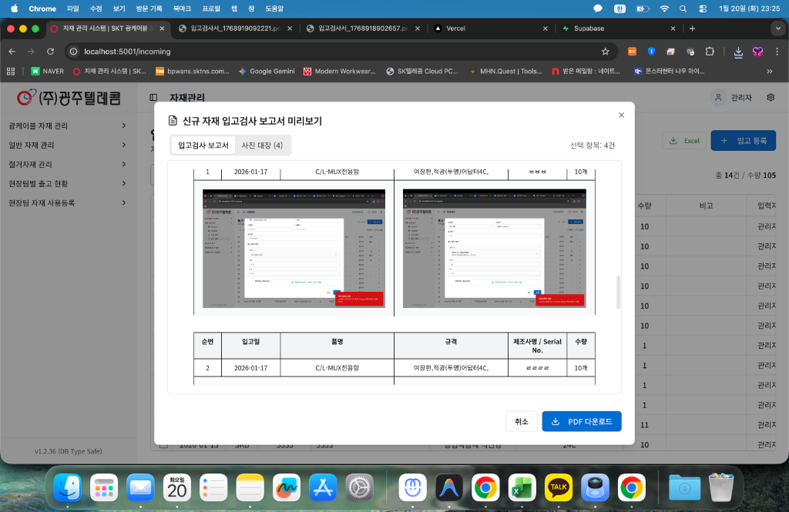

# KJ Telecom ERP 사용자 매뉴얼

> 버전 1.2.26 | 최종 업데이트: 2026-01-16

## 📋 목차

1. [시스템 개요](#1-시스템-개요)
2. [시작하기](#2-시작하기)
3. [대시보드](#3-대시보드)
4. [일반 자재 관리](#4-일반-자재-관리)
5. [광케이블 관리](#5-광케이블-관리)
6. [현장팀 관리](#6-현장팀-관리)
7. [관리자 기능](#7-관리자-기능)
8. [FAQ](#8-faq)
9. [트러블슈팅](#9-트러블슈팅)

---

## 1. 시스템 개요

### 1.1 시스템 소개

KJ Telecom ERP는 통신 공사 자재를 효율적으로 관리하기 위한 웹 기반 시스템입니다.

**주요 목적**:
- 일반 자재 및 광케이블 재고 관리
- 현장팀 자재 출고 및 사용 내역 추적
- 입출고 이력 관리 및 통계 분석

### 1.2 시스템 구성

```
사무실 재고 ←→ 현장팀 보유 자재
     ↓              ↓
  입고/출고      사용/반납
     ↓              ↓
    통합 재고 현황 관리
```

### 1.3 사용자 권한

| 권한 유형 | 설명 | 주요 기능 |
|---------|------|---------|
| **관리자** | 전체 시스템 관리 | 모든 기능 + 멤버 관리 |
| **사무실** | 입출고 관리 | 재고, 입고, 출고 관리 |
| **현장팀** | 사용 내역 등록 | 자재 사용 기록 |
| **조회 전용** | 읽기 권한만 | 데이터 조회만 가능 |

---

## 2. 시작하기

### 2.1 로그인

1. 브라우저에서 시스템 URL 접속
2. 아이디와 비밀번호 입력
3. **로그인** 버튼 클릭

> 💡 **Tip**: 비밀번호를 잊으셨다면 관리자에게 문의하세요.

### 2.2 화면 구성

```
┌─────────────────────────────────────┐
│  [로고]  KJ Telecom ERP    [사용자] │ ← 상단 헤더
├─────────────────────────────────────┤
│ ┌──────┐                            │
│ │ 메뉴 │  메인 콘텐츠 영역           │
│ │      │                            │
│ │ 대시 │  (페이지 내용)             │
│ │ 보드 │                            │
│ │      │                            │
│ │ 재고 │                            │
│ │ 관리 │                            │
│ └──────┘                            │
└─────────────────────────────────────┘
```

### 2.3 메뉴 구조

- **대시보드**: 전체 현황 요약
- **일반 자재**
  - 재고 현황
  - 입고 내역
  - 출고 내역
- **광케이블**
  - 광케이블 현황
  - 입고 내역
  - 출고 내역
- **현장팀**
  - 팀별 보유 현황
  - 자재 사용 내역
  - 광케이블 사용 내역
- **관리자** (권한 있는 사용자만)
  - 멤버 관리
  - 조직 관리

---

## 3. 대시보드

### 3.1 개요

대시보드는 시스템의 전체 현황을 한눈에 파악할 수 있는 메인 화면입니다.

<!-- 스크린샷 자리표시자 -->
> 📸 **스크린샷**: 대시보드 전체 화면
> 
> *이미지 추가 예정*

### 3.2 주요 지표

#### 총 재고량
- 현재 보유 중인 전체 자재 수량
- 사무실 + 현장팀 재고 합계

#### 총 재고 금액
- 현재 재고의 총 금액
- 단가 × 수량 합계

#### 활성 현장팀
- 현재 활동 중인 현장팀 수
- 비활성 팀 제외

#### 재고 부족 품목
- 재고가 10개 미만인 품목 수
- ⚠️ 주의 필요

### 3.3 항목별 재고 현황

카테고리별로 그룹화된 재고 통계:
- 품목 수
- 총 수량
- 총 금액

### 3.4 현장팀 현황

각 현장팀의:
- 팀명
- 보유 자재 종류 수
- 마지막 활동 일시
- 활성 상태

### 3.5 사업부 필터

우측 상단의 사업부 선택:
- **전체**: 모든 사업부 데이터
- **SKT**: SKT 사업부만
- **SKB**: SKB 사업부만

---

## 4. 일반 자재 관리

### 4.1 재고 현황

#### 4.1.1 재고 조회

**기능**: 전체 자재 재고 목록 확인

**화면 구성**:
- 검색창: 품명, 규격으로 검색
- 필터: 사업부, 카테고리 선택
- 테이블: 재고 목록

**테이블 컬럼**:
| 컬럼 | 설명 |
|------|------|
| 품명 | 자재 이름 |
| 규격 | 자재 규격 |
| 사업 | SKT/SKB |
| 카테고리 | 자재 분류 |
| 단가 | 개당 가격 |
| 재고 | 현재 수량 |
| 사무실 | 사무실 보유량 |
| 현장팀 | 현장팀 보유량 |
| 금액 | 재고 총액 |

#### 4.1.2 재고 등록

1. **신규 등록** 버튼 클릭
2. 품목 정보 입력:
   - 품명 *
   - 규격 *
   - 사업 (SKT/SKB) *
   - 카테고리
   - 단가 *
   - 초기 재고 수량
3. **저장** 버튼 클릭

> ⚠️ **주의**: * 표시는 필수 입력 항목입니다.

#### 4.1.3 재고 수정

1. 수정할 품목 행의 **⋮** (더보기) 클릭
2. **수정** 선택
3. 정보 변경
4. **저장** 버튼 클릭

#### 4.1.4 재고 삭제

1. 삭제할 품목 선택 (체크박스)
2. **선택 삭제** 버튼 클릭
3. 확인 대화상자에서 **확인**

> ⚠️ **주의**: 삭제된 데이터는 복구할 수 없습니다.

#### 4.1.5 Excel 일괄 등록

**기능**: Excel 파일로 대량 재고 등록

**절차**:
1. **일괄 등록** 버튼 클릭
2. Excel 파일 선택 또는 드래그
3. 모드 선택:
   - **덮어쓰기**: 기존 데이터 교체
   - **이어쓰기**: 기존 수량에 합산
4. **업로드** 버튼 클릭

**Excel 형식**:
```
품명 | 규격 | 사업 | 카테고리 | 단가 | 수량
케이블 | 100m | SKT | 광케이블 | 50000 | 10
```

#### 4.1.6 Excel 다운로드

1. **Excel 다운로드** 버튼 클릭
2. 파일 저장 위치 선택
3. 다운로드 완료

---

### 4.2 입고 내역

#### 4.2.1 입고 조회

**기능**: 자재 입고 이력 확인

**테이블 컬럼**:
- 입고일
- 품명
- 규격
- 사업
- 수량
- 단가
- 금액
- 공급처
- 비고
- 첨부파일
- 등록자

#### 4.2.2 입고 등록

1. **입고 등록** 버튼 클릭
2. 입고 정보 입력:
   - 입고일 *
   - 품목 선택 * (드롭다운)
   - 수량 *
   - 단가
   - 공급처
   - 비고
   - 첨부파일 (선택)
3. **저장** 버튼 클릭

**첨부파일 업로드**:
- 파일 선택 또는 드래그 앤 드롭
- 지원 형식: PDF, 이미지, Excel 등
- 최대 크기: 10MB

#### 4.2.3 입고 수정/삭제

- 수정: **⋮** → **수정**
- 삭제: **⋮** → **삭제**

#### 4.2.4 Excel 일괄 등록

입고 내역도 Excel로 일괄 등록 가능:
1. **일괄 등록** 버튼
2. Excel 파일 업로드
3. 모드 선택 (덮어쓰기/이어쓰기)

---

### 4.2.5 입고 검사서 출력

**기능**: 선택한 입고 내역에 대한 검사 보고서(ISO 표준 양식) 및 사진 대장 생성

**절차**:
1. 목록에서 검사서를 출력할 항목들을 체크박스로 선택
2. 상단 검색창 옆의 **입고 검사서 출력** 버튼 클릭
3. 미리보기 화면에서 내용 확인:
   - **입고검사 보고서**: 자재 정보 및 검사 항목 확인
   - **사진 대장**: 첨부된 현장 사진 확인 (품목별 자동 정렬)
4. **엑셀 다운로드** 버튼 클릭하여 파일 저장

<!-- 이미지 추가 위치: 입고 검사서 미리보기 화면 -->
> 📸 **스크린샷**: 입고 검사서 미리보기 및 다운로드 화면
>
> 

**주요 특징 (v1.2.37 업데이트)**:
- **이미지 자동 최적화**: 첨부 사진을 자동으로 리사이즈 및 압축하여 파일 용량 최소화 (기존 대비 60~80% 감소)
- **스마트 레이아웃**: 사진이 Excel 셀에 꽉 차게 자동으로 조절되며, A4 용지 기준 페이지당 품목 3개씩 깔끔하게 배치됨
- **보고서 통합**: 입고검사 리스트와 사진 대장이 하나의 파일로 출력됨

---

### 4.3 출고 내역

#### 4.3.1 출고 조회

**기능**: 현장팀으로 출고한 자재 이력

**테이블 컬럼**:
- 출고일
- 품명
- 규격
- 사업
- 현장팀
- 수량
- 수령자
- 공사명
- 비고
- 첨부파일

#### 4.3.2 출고 등록

1. **출고 등록** 버튼 클릭
2. 출고 정보 입력:
   - 출고일 *
   - 품목 선택 *
   - 현장팀 선택 *
   - 수량 *
   - 수령자
   - 공사명
   - 비고
   - 첨부파일
3. **저장** 버튼 클릭

> 💡 **Tip**: 출고 시 사무실 재고가 자동으로 차감되고, 현장팀 재고가 증가합니다.

#### 4.3.3 Excel 일괄 등록

출고 내역도 Excel로 일괄 등록 가능

---

## 5. 광케이블 관리

### 5.1 광케이블 현황

#### 5.1.1 개요

광케이블은 드럼 단위로 관리되며, 각 드럼의:
- 제조번호 (고유 식별자)
- 총 길이
- 사용 길이
- 폐기 길이
- 잔여 길이
- 현재 위치 (사무실/현장팀)

#### 5.1.2 광케이블 조회

**필터 옵션**:
- 사업부 (SKT/SKB)
- 상태:
  - 재고: 사무실 보관 중
  - 불출: 현장팀 사용 중
  - 사용완료: 잔여 없음
  - 폐기: 폐기 처리됨
  - 반납신청: 반납 대기 중

**테이블 컬럼**:
- 제조번호
- 사업
- 총 길이
- 사용 길이
- 폐기 길이
- 잔여 길이
- 상태
- 현재 팀
- 등록일

#### 5.1.3 광케이블 등록

1. **신규 등록** 버튼 클릭
2. 정보 입력:
   - 제조번호 * (고유값)
   - 사업 (SKT/SKB) *
   - 총 길이 (m) *
   - 구분 (광케이블/철거/구매)
   - 비고
3. **저장** 버튼 클릭

#### 5.1.4 광케이블 상세 정보

제조번호 클릭 시 상세 정보 팝업:
- 기본 정보
- 사용 이력
- 이동 이력
- 첨부 문서

---

### 5.2 광케이블 입고

#### 5.2.1 입고 등록

1. **입고 등록** 버튼
2. 정보 입력:
   - 입고일 *
   - 제조번호 * (신규 또는 기존)
   - 사업 *
   - 총 길이 *
   - 공급처
   - 비고
3. **저장**

#### 5.2.2 Excel 일괄 입고

대량의 광케이블 입고 시 사용:
1. **일괄 등록** 버튼
2. Excel 파일 업로드
3. 모드 선택

**Excel 형식**:
```
제조번호 | 사업 | 총길이 | 공급처 | 비고
2024-001 | SKT | 2000 | OO통신 | -
```

---

### 5.3 광케이블 출고

#### 5.3.1 출고 등록

1. **출고 등록** 버튼
2. 정보 입력:
   - 출고일 *
   - 제조번호 선택 * (재고 중인 케이블만)
   - 현장팀 선택 *
   - 수령자
   - 공사명
3. **저장**

> 💡 **Tip**: 출고 시 케이블 상태가 자동으로 "불출"로 변경됩니다.

---

### 5.4 광케이블 사용 내역

#### 5.4.1 사용 등록

현장에서 케이블 사용 시:
1. **사용 등록** 버튼
2. 정보 입력:
   - 사용일 *
   - 제조번호 선택 *
   - 사용 길이 *
   - 폐기 길이
   - 공사명
   - 비고
   - 폐기 사진 (선택)
3. **저장**

**자동 계산**:
- 잔여 길이 = 총 길이 - 사용 길이 - 폐기 길이
- 잔여 0m 시 자동으로 "사용완료" 상태로 변경

---

## 6. 현장팀 관리

### 6.1 팀별 보유 현황

#### 6.1.1 일반 자재 보유 현황

**기능**: 각 현장팀이 보유한 일반 자재 조회

**화면 구성**:
- 현장팀 선택 드롭다운
- 보유 자재 목록 테이블

**테이블 컬럼**:
- 품명
- 규격
- 사업
- 보유 수량
- 마지막 사용일

#### 6.1.2 광케이블 보유 현황

**기능**: 각 현장팀이 보유한 광케이블 조회

**테이블 컬럼**:
- 제조번호
- 사업
- 총 길이
- 사용 길이
- 잔여 길이
- 상태

---

### 6.2 자재 사용 내역

#### 6.2.1 사용 내역 조회

**필터**:
- 현장팀 선택
- 기간 선택
- 사업부 선택

**테이블 컬럼**:
- 사용일
- 품명
- 규격
- 사업
- 수량
- 공사명
- 등록자
- 비고

#### 6.2.2 사용 내역 등록

1. **사용 등록** 버튼
2. 정보 입력:
   - 사용일 *
   - 현장팀 선택 *
   - 품목 선택 * (해당 팀 보유 자재만)
   - 사용 수량 *
   - 공사명
   - 비고
3. **저장**

> 💡 **Tip**: 사용 등록 시 현장팀 재고가 자동으로 차감됩니다.

#### 6.2.3 Excel 일괄 등록

대량의 사용 내역 등록:
1. **일괄 등록** 버튼
2. Excel 파일 업로드
3. 모드 선택

---

### 6.3 자재 반납

#### 6.3.1 반납 신청

현장팀에서 자재 반납 시:
1. 반납할 자재 선택
2. **반납 신청** 버튼
3. 반납 수량 입력
4. **신청** 버튼

#### 6.3.2 반납 승인 (사무실)

1. 반납 신청 목록 확인
2. **승인** 버튼 클릭
3. 자동으로:
   - 현장팀 재고 차감
   - 사무실 재고 증가

---

## 7. 관리자 기능

### 7.1 멤버 관리

#### 7.1.1 멤버 목록

**테이블 컬럼**:
- 이름
- 아이디
- 직급/부서
- 연락처
- 권한
- 상태
- 가입일

#### 7.1.2 멤버 생성

1. **멤버 생성하기** 버튼
2. 정보 입력:
   - 아이디 *
   - 비밀번호 *
   - 이름 *
   - 전화번호
   - 직급 *
   - 소속 부서 *
   - 소속 팀
   - 초기 권한 설정
3. **멤버 생성** 버튼

**권한 프리셋**:
- **사무실**: 전체 읽기/쓰기
- **현장팀**: 사용 내역만 쓰기
- **조회 전용**: 전체 읽기만
- **직접 설정**: 세부 권한 개별 설정

#### 7.1.3 멤버 정보 수정

1. 멤버 행의 **⋮** 클릭
2. **정보 수정** 선택
3. 정보 변경
4. **저장**

#### 7.1.4 권한 변경

1. **⋮** → **상세 권한 설정**
2. 각 기능별 권한 설정:
   - 입고 관리: 없음/조회/수정
   - 출고 관리: 없음/조회/수정
   - 사용 내역: 없음/조회/수정
   - 재고 현황: 없음/조회/수정
3. **저장**

#### 7.1.5 멤버 삭제

1. **⋮** → **멤버 삭제**
2. 확인 대화상자에서 **확인**

---

### 7.2 조직 관리

#### 7.2.1 부서 관리

**기능**: SKT, SKB 등 사업부 관리

- 부서 추가
- 부서 수정
- 부서 삭제

#### 7.2.2 팀 관리

**기능**: 현장팀 관리

**팀 정보**:
- 팀명
- 소속 부서
- 활성 상태
- 팀원 수

**팀 추가**:
1. **팀 추가** 버튼
2. 팀명 입력
3. 소속 부서 선택
4. **저장**

#### 7.2.3 직급 관리

**기능**: 직급 체계 관리

- 직급 추가
- 직급 수정
- 직급 삭제

---

## 8. FAQ

### Q1. 비밀번호를 잊어버렸어요.
**A**: 관리자에게 문의하여 비밀번호를 재설정 받으세요.

### Q2. Excel 일괄 등록 시 오류가 발생해요.
**A**: Excel 파일 형식을 확인하세요:
- 첫 행은 헤더(컬럼명)
- 필수 컬럼 누락 확인
- 데이터 형식 확인 (숫자는 숫자로)

### Q3. 재고가 마이너스로 표시돼요.
**A**: 출고나 사용 내역이 입고보다 많을 때 발생합니다. 입고 내역을 확인하고 누락된 입고를 등록하세요.

### Q4. 첨부파일이 다운로드되지 않아요.
**A**: 
- 브라우저 팝업 차단 해제
- 파일이 실제로 업로드되었는지 확인
- 네트워크 연결 확인

### Q5. 현장팀 재고가 업데이트되지 않아요.
**A**: 
- 출고 등록 후 자동 반영
- 페이지 새로고침 (F5)
- 캐시 삭제 후 재시도

### Q6. Excel 다운로드 시 한글이 깨져요.
**A**: Excel에서 파일 열 때:
1. 데이터 탭 → 텍스트 나누기
2. 인코딩을 UTF-8로 선택

### Q7. 모바일에서도 사용할 수 있나요?
**A**: 네, 반응형 디자인으로 모바일/태블릿에서도 사용 가능합니다.

### Q8. 데이터를 실수로 삭제했어요.
**A**: 삭제된 데이터는 복구할 수 없습니다. 관리자에게 문의하여 백업에서 복구 가능 여부를 확인하세요.

---

## 9. 트러블슈팅

### 9.1 로그인 문제

**증상**: 로그인이 되지 않음

**해결 방법**:
1. 아이디/비밀번호 확인
2. Caps Lock 확인
3. 브라우저 쿠키 삭제
4. 다른 브라우저로 시도

---

### 9.2 데이터 로딩 문제

**증상**: 데이터가 표시되지 않음

**해결 방법**:
1. 페이지 새로고침 (F5)
2. 브라우저 캐시 삭제
3. 네트워크 연결 확인
4. 관리자에게 문의

---

### 9.3 파일 업로드 문제

**증상**: 파일 업로드 실패

**해결 방법**:
1. 파일 크기 확인 (10MB 이하)
2. 파일 형식 확인
3. 네트워크 연결 확인
4. 다른 파일로 시도

---

### 9.4 Excel 일괄 등록 문제

**증상**: Excel 업로드 시 오류

**해결 방법**:
1. Excel 형식 확인:
   - 첫 행: 헤더
   - 필수 컬럼 포함
   - 데이터 형식 올바른지 확인
2. 샘플 파일 다운로드하여 형식 참조
3. 소량으로 나누어 업로드

---

### 9.5 성능 문제

**증상**: 시스템이 느림

**해결 방법**:
1. 브라우저 캐시 삭제
2. 불필요한 탭 닫기
3. 브라우저 재시작
4. 필터 사용하여 데이터 양 줄이기

---

## 📞 지원

추가 문의사항이나 기술 지원이 필요하시면:

- **이메일**: support@kjtelecom.com
- **전화**: 02-XXXX-XXXX
- **업무 시간**: 평일 09:00 - 18:00

---

**문서 버전**: 1.0.0  
**최종 업데이트**: 2026-01-16  
**작성자**: KJ Telecom 개발팀
